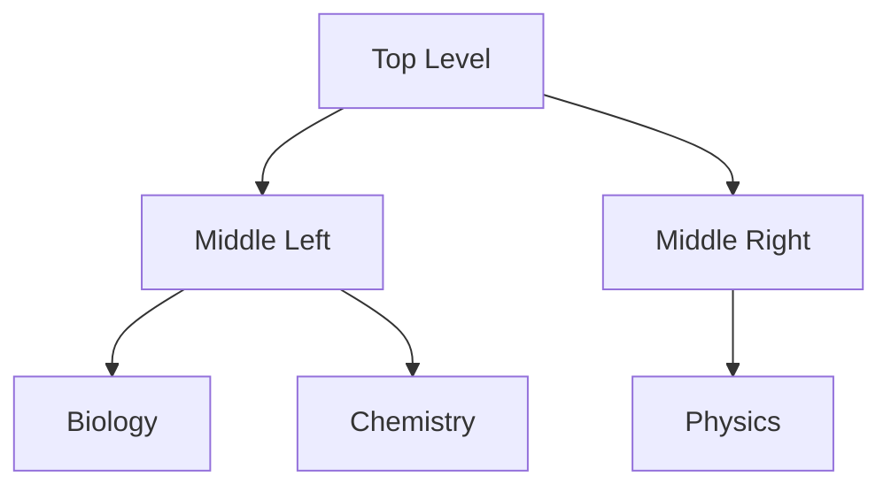

### Why Computational Social Science Now?

**The Digital Revolution** led to a massive increase in the amount of information that was stored digitally, and thus led to a massive increase in the analysis and computation that could be done digitally.

For example, the world was able to store aroudn 5 zettabytes of digital information in 2014; for reference, if all of it was condensed into piles of books, it would reach the Sun 4500 times.

It is worth noting that evolutionary theory states that every time something major happens in life's history, it coincides with when there was a major innovation in information processing. As a result, it is now generally accepted that the next stage of evolution is digital.

**Historical context** for why computational social science _now_; an American scientist, Warren Weaver, talked about the three kinds of problems people have been working on in the history of science, and they're problems of **simplicity**, **averages**, and of **organized complexity**. Problems of **organized complexity** are not those with a small number of related variables like problems of simiplicity, and they cannot be dealt with using the known distributions that are useful in summarizing large amounts of data, like problems of averages. Problems of organized complexity are those that have a large number of interrelated variables, and they are the problems that social scientists have been working on for a long time. However, it was not until the digital revolution that we had the tools to deal with these problems.

#### A Very Simplistic Hierarchy of Science

