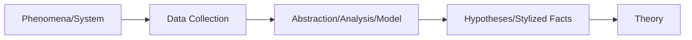
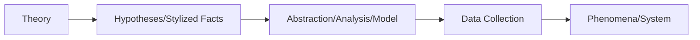

### What Does Computational Social Science Cover?

CSS fits within the broader picture of the scientific method.

The scientific method is based on three legs; empirical (observations of reality), theoretical, and analytical (is an intersection of empirical and theoretical).

An example of **empirical** research is the evolutionary theory, developed by Charles Darwin. An example of **theoretical** research is the theory of relativity, developed by Albert Einstein.

While empirical methods look at what happened (that's big data, essentially), theoretical methods start with why certain phenomenon happen. The intersection of the Venn diagram, the analytical methods, try to bridge the two by understanding how something occurred.

#### The Scientific Method

**The Inductive Scientific Method**

**The Deductive Scientific Method**

In the recent past, the scientific method has become more radial than linear, making it a continuous method.

**Some Important Things To Take Note Of**

- In the case of Induction, oftentimes, data is used simply because data is there; a good analogy is that of a man who lot his keys somewhere in the darkness but is looking for them in a different spot because there is light under the lamppost.

- In the case of Deduction, lots of theories can build elaborate mental models or logical frameworks that lack sufficient empirical data to properly support or validate them.

#### Glass of Red Wine Theorizing

A method of deducing hypotheses that is unique to the social sciences is to examine the **logical interrelationships among some collection of verbal statements or thoughts**.

This type of theorizing can be inductive or deductive in nature;
and this inconsistent and informal method has actually directly contribute to the **replication crisis**.

#### Note

A hypothesis cannot be **proven**, it can only stand true until it is **disproven**.
